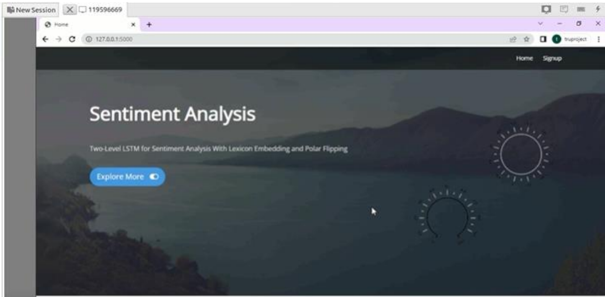
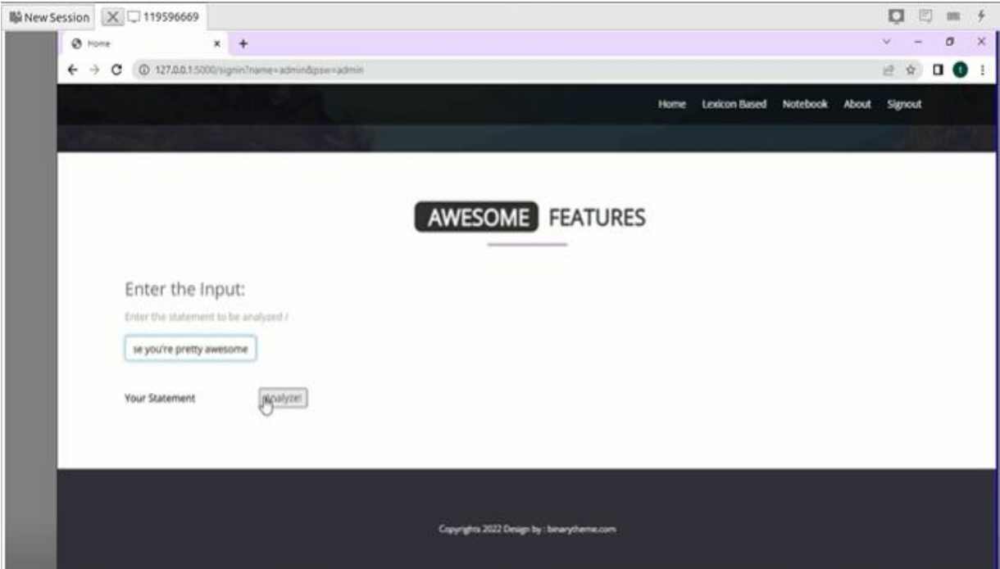
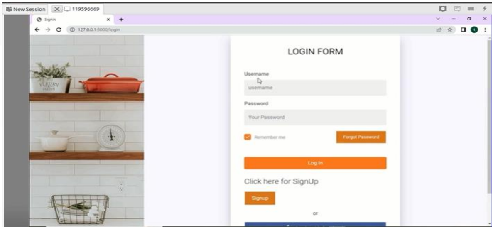
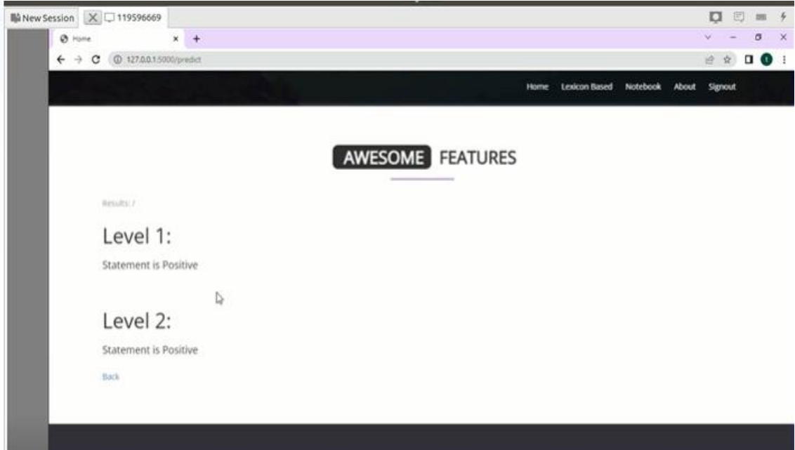
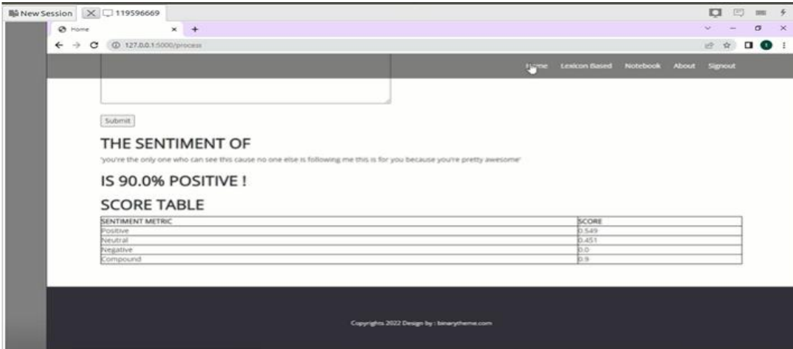

# LSTM Sentiment Analysis with Lexicon Embedding

## Overview
This project implements a sentiment analysis system using a two-level LSTM architecture combined with lexicon embedding and polar flipping concepts. The goal is to improve sentiment classification by handling complex sentiment expressions more effectively than basic text classification approaches.

## Problem Statement
Traditional sentiment analysis models often assume clean and accurately labeled datasets. In practice, text data can contain noisy labels, mixed sentiment, negation, and contextual polarity shifts, which make classification difficult.

## Approach
This project uses:
- Two-level LSTM for hierarchical sentiment feature learning
- Lexicon embedding to incorporate sentiment-related linguistic cues
- Polar flipping concepts to better handle contextual sentiment changes
- Flask-based interface for basic user interaction

## Technologies Used
- Python
- TensorFlow / Keras
- NumPy
- Pandas
- Scikit-learn
- Flask
- Matplotlib

## Workflow
1. Load and preprocess text data
2. Clean and tokenize text
3. Convert text into padded sequences
4. Train LSTM-based sentiment classification model
5. Evaluate model performance
6. Use Flask interface for prediction

## Repository Structure
- `sentiment_analysis.ipynb` – notebook for preprocessing, training, and evaluation
- `requirements.txt` – project dependencies
- `images/` – screenshots of the project interface and output

## Sample Output

### Home Page

### Input Page

### Login Form

### Prediction Output 1

### Prediction Output 2

## Future Improvements
- Improve model performance with hyperparameter tuning
- Use pretrained embeddings such as Word2Vec or GloVe
- Deploy the application on cloud platforms
- Add stronger evaluation reporting and reproducibility setup
